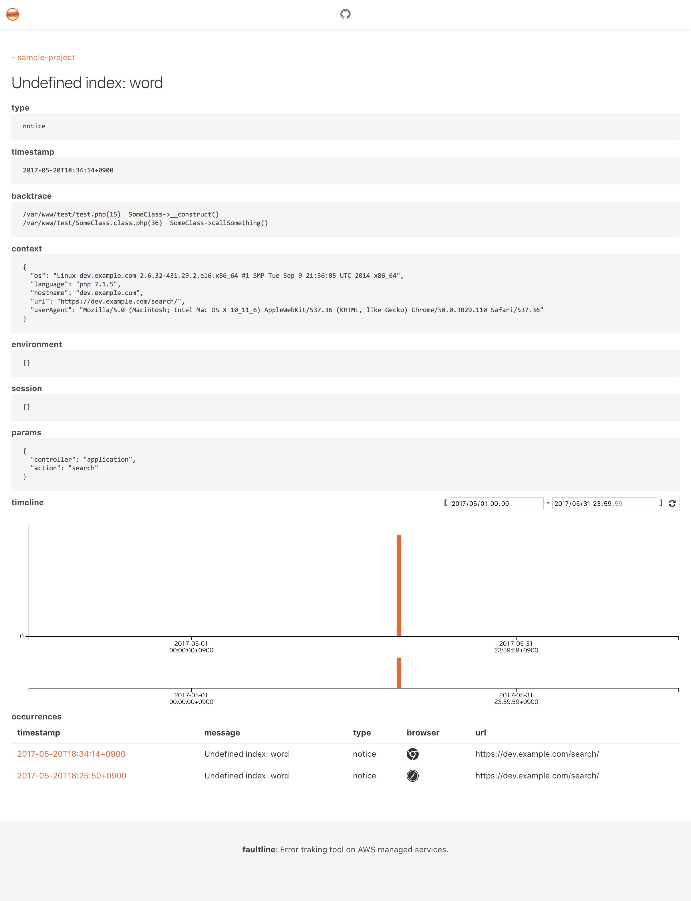

# faultline [](https://travis-ci.org/faultline/faultline) [](https://github.com/faultline/faultline/releases) [](https://coveralls.io/github/faultline/faultline?branch=master)

> Error tracking tool on AWS managed services.


[Migration Guide: from v0.x to v1.x](docs/migration_v0_to_v1.md)

## Table of Contents

- [Concept](#concept)
- [Using framework](#using-framework)
- [How to deploy](#how-to-deploy)
- [Usage](#usage)
    - [Notifications](#notifications)
- [API](#api)
- [Web UI](#web-ui)
- [Architecture](#architecture)
- [Run test](#run-test)
- [Contribute](#contribute)
- [License](#license)

## Concept

- Simple deploy
- Manageless
- POST errors with config
- Between "Only mail notify" and "[Error tracking services](https://www.google.co.jp/search?q=error%20tracking%20service)"

## Using framework

- Serverless Framework :zap:

### AWS Resources

- AWS Lambda
- API Gateway
- Amazon S3
- Amazon DynamoDB
- IAM
- KMS (option)

## How to deploy

### :octocat: STEP 1. Clone

```sh
$ git clone https://github.com/faultline/faultline.git
$ cd faultline
$ npm install
```

### :pencil: STEP 2. Set environment variables OR Edit config.yml

Set environment variables.

OR

Copy [`config.default.yml`](config.default.yml) to `config.yml`. And edit.

Environment / config.yml Document is [here](docs/env.md) :book: .

### :rocket: STEP 3. Deploy to AWS

```sh
$ AWS_PROFILE=XXxxXXX npm run deploy
```

#### :bomb: Destroy faultline

1. Delete all projects (or Empty S3 bucket).
2. Run following command.

```sh
$ AWS_PROFILE=XXxxXXX npm run destroy
```

## Usage

### POST errors using cURL

Example:

```sh
$ curl -X POST -H "x-api-key: xxxxXXXXXxXxXXxxXXXXXXXxxxxXXXXXX" -H "Content-Type: application/json" -d @sample-errors.json https://xxxxxxxxx.execute-api.ap-northeast-1.amazonaws.com/v0/projects/sample-project/errors
```

Sample errors POST JSON file is [here](sample-errors.json).

API Document is [here](docs/api.md) :book: .

### POST errors using library

- https://github.com/faultline/faultline-php
- https://github.com/faultline/faultline-js
- https://github.com/faultline/faultline-ruby
- https://github.com/faultline/faultline-rack

### Notifications

When receive error, faultline can send nofitications with POST config.

More document is [here](docs/notifications.md) :book: .

#### :speech_balloon: Slack


#### :octocat: GitHub issue


#### :large_orange_diamond: GitLab issue


## API

[API Document](docs/api.md) generated by [jdoc](https://github.com/r7kamura/jdoc).

JSON Hyper-Schema is [here](schema.json) :book: .

## Web UI

Sample web UI for faultline

https://github.com/faultline/faultline-webui



## Architecture

"Architecture of faultline" document is [here](docs/architecture.md) :book: .

## Run test

``` sh
$ docker-compose up -d
$ npm run test
```

### Docker for Mac

``` sh
$ TMPDIR=/private$TMPDIR docker-compose up -d
$ npm run test
```

## Contribute

PRs accepted.

## License

MIT © Ken&#39;ichiro Oyama
