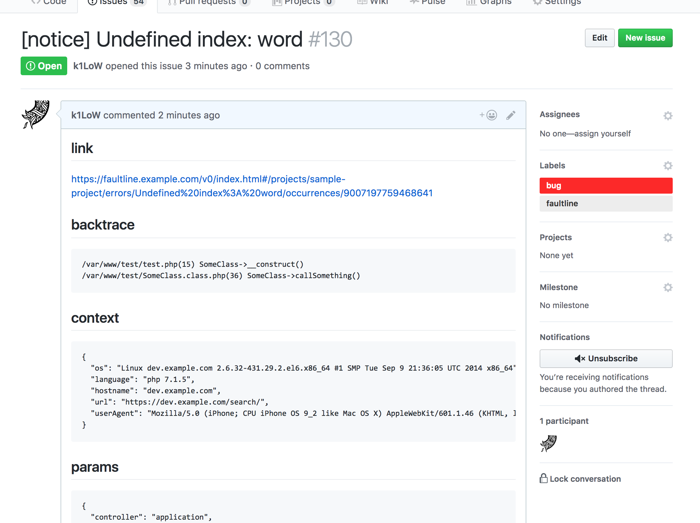

# faultline

> Error tracking tool on AWS managed services.


## Table of Contents

- [Concept](#concept)
- [Using framework](#using-framework)
- [How to deploy](#how-to-deploy)
- [Usage](#usage)
- [API](#api)
- [Web UI](#web-ui)
- [Architecture](#architecture)
- [TODO](#todo)
- [Contribute](#contribute)
- [License](#license)

## Concept

- Simple deploy
- Manageless
- POST errors with config
- Between "Only mail notify" and "[Error tracking services](https://www.google.co.jp/search?q=error%20tracking%20service)"

## Using framework

- Serverless Framework :zap:

### AWS Resources

- AWS Lambda
- API Gateway
- Amazon S3
- Amazon DynamoDB
- IAM
- KMS (option)

## How to deploy

### :octocat: STEP 1. Clone

```sh
$ git clone https://github.com/k1LoW/faultline.git
$ cd faultline
$ npm install
```

### :pencil: STEP 2. Edit config

Copy [`config.default.yml`](config.default.yml) to `config.yml`. And edit.

### :rocket: STEP 3. Deploy to AWS

```sh
$ AWS_PROFILE=XXxxXXX npm run deploy
```

#### :bomb: Destroy faultline

1. Delete all projects (or Empty S3 bucket).
2. Run following command.

```sh
$ AWS_PROFILE=XXxxXXX npm run destroy
```

## Usage

### POST errors using cURL

Example:

```sh
$ curl -X POST -H "x-api-key: xxxxXXXXXxXxXXxxXXXXXXXxxxxXXXXXX" -H "Content-Type: application/json" -d @sample-errors.json https://xxxxxxxxx.execute-api.ap-northeast-1.amazonaws.com/v0/projects/sample-project/errors
```

Sample errors POST JSON file is [here](sample-errors.json).

API Document is [here](docs/api.md) :book: .

### POST errors using library

- https://github.com/faultline/faultline-php
- https://github.com/faultline/faultline-js
- https://github.com/faultline/faultline-ruby
- https://github.com/faultline/faultline-rack

### Notifications

When receive error, faultline can send nofitications with POST config.

More document is [here](docs/notifications.md) :book: .

#### :speech_balloon: Slack


#### :octocat: GitHub issue



## API

[API Document](docs/api.md) generated by [jdoc](https://github.com/r7kamura/jdoc).

JSON Hyper-Schema is [here](schema.json) :book: .

## Web UI

Sample web UI for faultline

https://github.com/faultline/faultline-webui


## Architecture

"Architecture of faultline" document is [here](docs/architecture.md) :book: .

## TODO

- [ ] Refactor API response format
- [ ] Notification
    - [x] Slack
    - [x] GitHub Issue
    - [ ] ???
- [ ] Error Notify Filter
- [ ] API Gateway API Key (waiting CFn/Serverless "Usage plan" support. see [#2450](https://github.com/serverless/serverless/issues/2450) )

## Contribute

PRs accepted.

## License

MIT © Ken&#39;ichiro Oyama
