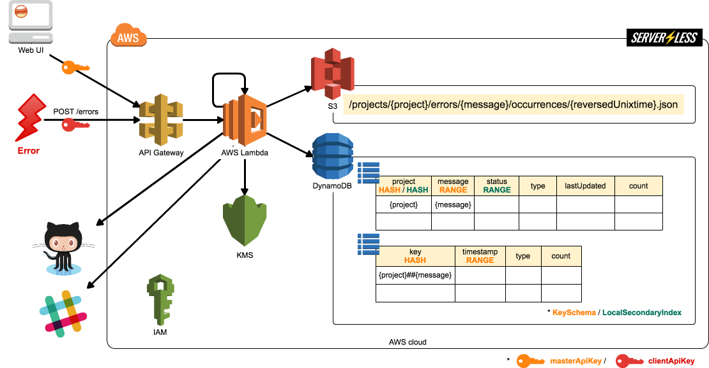

# Architecture of faultline

## Data store on AWS managed services.

faultline store error data in AWS managed services.

### S3 Bucket

#### FaultlineBucket

faultline put raw error data in JSON format.

`/projects/{project}/errors/{message}/occurrences/{reversedUnixtime}.json`

### DynamoDB Table

#### FaultlineTable

| project | message | status | type | lastUpdated | count |
| - | - | - | - | - | - |
| `{project}`| `{message}` | | | | |

#### FaultlineTableByTimeunit

| key | timestamp | status | type | count |
| - | - | - | - | - |
| `{project}##{message}` | | | | |

## API request validation with JSON Hyper-Schema

JSON Hyper-Schema is [here](../schema.json).
