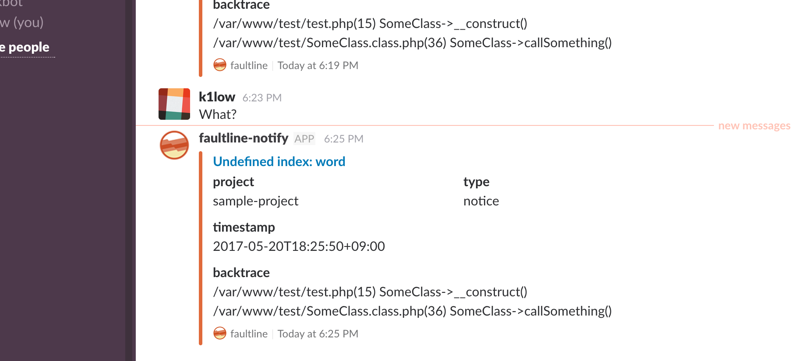

# Notifications

When receive error, faultline can send nofitications with POST config.

## Support notifications

### :speech_balloon: Slack

POST errors with Slack notification config.

#### config

```json5
{
  "errors": [

   - snip -

  ],
  "notifications": [
    {
      "type": "slack",
      "endpoint": "https://hooks.slack.com/services/XXXXXXXX/XXXXXXXX/XXXxxXXXXXXxxxxXXXXXXX",
      "channel": "#faultline",
      "username": "faultline-notify",
      "notifyInterval": 5,
      "threshold": 10,
      "timezone": "Asia/Tokyo",
      "linkTemplate": "https://faultline.example.com/v0/index.html#/projects/{project}/errors/{message}/occurrences/{reversedUnixtime}"
    }
  ]
}
```

| Key | Description | Example |
| - | - | - |
| type | Notification type ( **required** `slack`) | `slack` |
| endpoint | Slack incoming webhook endpoint ( **required** ) | `https://hooks.slack.com/services/XXXXXXXX/XXXXXXXX/XXXxxXXXXXXxxxxXXXXXXX` |
| channel | Slack channel ( **required** ) | `#faultline` |
| username | Slack username | `faultline-notify` |
| notifyInterval | Slack notify interval | `5` |
| threshold | Slack notify threshold | `10` |
| timezone | timezone for display | `Asia/Tokyo` |
| linkTemplate | Link template for Slack notify title link | `https://faultline.example.com/v0/index.html#/projects/{project}/errors/{message}/occurrences/{reversedUnixtime}` |
| linkExpires | The number of seconds for which S3 "error" object link should be valid | `300` |

#### Screenshot



### :octocat: GitHub issue

POST errors with GitHub repo config for creating issue.

#### config

```json5
{
  "errors": [

   - snip -

  ],
  "notifications": [
    {
      "type": "github",
      "userToken": "XXXXXXXxxxxXXXXXXxxxxxXXXXXXXXXX",
      "owner": "k1LoW",
      "repo": "faultline",
      "labels": [
        "faultline", "bug"
      ],
      "if_exist": "reopen-and-comment",
      "notifyInterval": 10,
      "threshold": 1,
      "timezone": "Asia/Tokyo",
      "linkTemplate": "https://faultline.example.com/v0/index.html#/projects/{project}/errors/{message}/occurrences/{reversedUnixtime}"
    }
  ]
}
```

| Key | Description | Example |
| - | - | - |
| type | Notification type ( **required** `github`) | `github` |
| userToken | GitHub API token ( **required** ) | `XXXXXXXxxxxXXXXXXxxxxxXXXXXXXXXX` |
| owner | GitHub repo owner ( **required** ) | `k1LoW` |
| repo | GitHub repo name ( **required** ) | `faultline` |
| endpoint | GitHub Endpoint Url | `https://gitlab.com` if you use GH:E `https://[hostname]/api/v3` |
| labels | GitHub Issue labels | `["bug", "wontfix"]` |
| if_exist | Action If current issue exist | `reopen-and-commend`, `reopen`, `reopen-and-update`, `comment`, `none` |
| notifyInterval | GitHub Issue open interval | `5` |
| threshold | GitHub Issue open threshold | `10` |
| timezone | timezone for display | `Asia/Tokyo` |
| linkTemplate | Template for link | `https://faultline.example.com/v0/index.html#/projects/{project}/errors/{message}/occurrences/{reversedUnixtime}` |
| linkExpires | The number of seconds for which S3 "error" object link should be valid | `300` |

#### Screenshot


#### :large_orange_diamond: GitLab issue

POST errors with GitLab repo config for creating issue.

#### config

```json5
{
  "errors": [

   - snip -

  ],
  "notifications": [
    {
      "type": "gitlab",
      "personalAccessToken": "XXXXXXXxxxxXXXXXXxxxxxXXXXXXXXXX",
      "owner": "k1LoW",
      "repo": "faultline",
      "labels": [
        "faultline", "bug"
      ],
      "if_exist": "reopen-and-comment",
      "notifyInterval": 10,
      "threshold": 1,
      "timezone": "Asia/Tokyo",
      "linkTemplate": "https://faultline.example.com/v0/index.html#/projects/{project}/errors/{message}/occurrences/{reversedUnixtime}"
    }
  ]
}
```

| Key | Description | Example |
| - | - | - |
| type | Notification type ( **required** `gitlab`) | `gitlab` |
| personalAccessToken |GitLab Personal Access Token ( **required** ) | `XXXXXXXxxxxXXXXXXxxxxxXXXXXXXXXX` |
| owner |GitLab repo owner ( **required** ) | `k1LoW` |
| repo |GitLab repo name ( **required** ) | `faultline` |
| endpoint |GitLab Endpoint Url | `https://gitlab.com` |
| labels |GitLab Issue labels | `["bug", "wontfix"]` |
| if_exist | Action If current issue exist | `reopen-and-commend`, `reopen`, `reopen-and-update`, `comment`, `none` |
| notifyInterval |GitLab Issue open interval | `5` |
| threshold |GitLab Issue open threshold | `10` |
| timezone | timezone for display | `Asia/Tokyo` |
| linkTemplate | Template for link | `https://faultline.example.com/v0/index.html#/projects/{project}/errors/{message}/occurrences/{reversedUnixtime}` |
| linkExpires | The number of seconds for which S3 "error" object link should be valid | `300` |

#### Screenshot


---

## :closed_lock_with_key: AWS KMS Encryption of `notifications` config

If you use faultline notifications on browser ( e.g [faultline-js](https://github.com/faultline/faultline-js) ), you should encrypt config.

### :key: STEP 1. `useKms` option true

Set `useKms: true` in config.yml, and deploy. Default AWS KMS Key alias is `alias/faultline`.

### :closed_lock_with_key: STEP 2. Encrypt notification config

Use `aws kms encrypt` command.

```sh
$ AWS_PROFILE=XXxxXXX aws kms encrypt --key-id alias/faultline --plaintext '{"type":"slack","endpoint":"https://hooks.slack.com/services/XXXXXXXX/XXXXXXXX/XXXxxXXXXXXxxxxXXXXXXX","channel":"#random","username":"faultline-notify","notifyInterval":5,"threshold":10}' --query CiphertextBlob --output text --region ap-northeast-1
XXXXXXxxxxXXXXXxxxxxxxxxxxxXXXXXXXXXXXXXxxxxxxxxxxxXXXXXxxxxxxxxXXXXxxxxxxxxXXXXXXXXXXXXxxxxx
```

OR

Use `/encrypt` API with apiKey (not clientApiKey).

```sh
$ curl -X POST -H "x-api-key:0123456789012345678901234567890" -H "Content-Type: application/json" https://xxxxxxxxx.execute-api.ap-northeast-1.amazonaws.com/v0/encrypt -d '{"type":"github","userToken":"XXXXXXXxxxxXXXXXXxxxxxXXXXXXXXXX","owner":"k1LoW","repo":"faultline","labels":["faultline","bug"],"if_exist":"reopen-and-comment","notifyInterval":10,"threshold":1,"timezone":"Asia/Tokyo"}'
{
  "status": "success",
  "encrypted": "ZZZZZZzzzzZZZZZzzzzzzzzzzzzZZZZZZZZZZZZZzzzzzzzzzzzZZZZZzzzzzzzzZZZZzzzzzzzzZZZZZZZZZZZZzzzzz"
}
```

### :lock: STEP 3. Set encrypted text as `notifications` config

```json5
{
  "errors": [

   - snip -

  ],
  "notifications": [
    "XXXXXXxxxxXXXXXxxxxxxxxxxxxXXXXXXXXXXXXXxxxxxxxxxxxXXXXXxxxxxxxxXXXXxxxxxxxxXXXXXXXXXXXXxxxxx",
    "ZZZZZZzzzzZZZZZzzzzzzzzzzzzZZZZZZZZZZZZZzzzzzzzzzzzZZZZZzzzzzzzzZZZZzzzzzzzzZZZZZZZZZZZZzzzzz",
    {
      "type": "slack",
      "endpoint": "https://hooks.slack.com/services/XXXXXXXX/XXXXXXXX/XXXxxXXXXXXxxxxXXXXXXX",
      "channel": "#faultline-other-channel",
      "username": "faultline-notify",
      "notifyInterval": 10,
      "threshold": 1
    }
  ]
}
```
